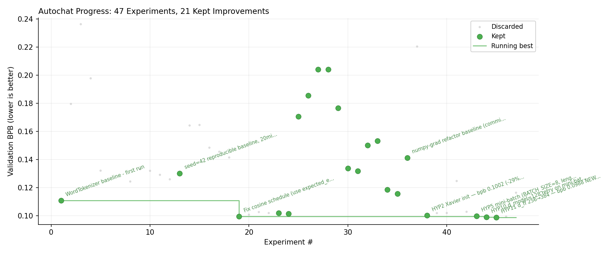

# autochat

AI agents running autonomous research on CPU-only GPT training.



Inspired by [karpathy/autoresearch](https://github.com/karpathy/autoresearch). The idea: give an AI agent a small but real LLM training setup and let it experiment autonomously. It modifies the code, trains for 10 minutes, checks if the result improved, keeps or discards, and repeats.

This is a pure NumPy implementation — no PyTorch, no GPU required. A char-level Transformer trained on Chinese QA pairs, built from scratch with explicit forward/backward/update for every op (matching the C++ [TETF](https://github.com/ryansoq/TETF) framework).

## How It Works

```
Agent modifies train.py → trains for 10 min → measures val_bpb
                                                    ↓
                                            improved? 
                                           ├─ ✅ KEEP (commit)
                                           └─ ❌ REVERT (git checkout)
```

The metric is **val_bpb** (validation bits per byte) — lower is better, and vocab-size-independent so architectural changes are fairly compared.

## Files

- `train.py` — model, optimizer, training loop. **The only file the agent edits.**
- `program.md` — instructions for the AI research agent. The human edits this.
- `experiments.jsonl` — log of all experiments (auto-appended).
- `progress.png` — bpb over experiments (auto-generated).

## Quick Start

```bash
# Run a single training experiment (~10 min on CPU)
python3 train.py

# Run with fixed 10-min time budget (autoresearch mode)
python3 train.py --auto

# Test trained model
python3 train.py --test

# Interactive chat
python3 train.py --chat
```

## Autonomous Research

Point your AI coding agent at this repo and prompt:

> Have a look at program.md and let's kick off a new experiment!

The agent will read the instructions, modify `train.py`, run training, evaluate, and iterate.

## Architecture

Pure NumPy char-level Transformer with explicit ops:

```
EmbeddingOp (token + positional)
  └─ TransformerBlockOp × N
       ├─ LayerNormOp (pre-norm)
       ├─ MultiHeadAttentionOp (causal)
       ├─ + residual
       ├─ LayerNormOp
       ├─ FFN (MatmulOp → GELU → MatmulOp)
       └─ + residual
  └─ MLPHeadOp
  └─ CrossEntropyLossOp
```

Every op implements `forward()`, `backward()`, and `update()` — matching the C++ TETF framework 1:1.

## Authors

Ryan & Nami ✨

## License

MIT
